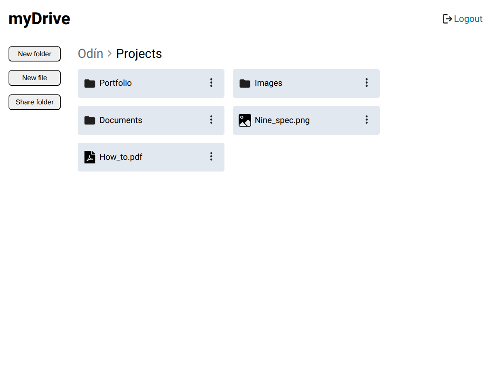

    
    <h1>File Uploader</h1>
    
Save your files on the cloud

    

        <a href="https://mydrive-ju7q.onrender.com" target="_blank" rel="noreferrer noopener">View Demo</a> · 
        <a href="https://github.com/jotafer19/drive/issues" target="_blank" rel="noreferrer noopener">Report Bug</a> ·
        <a href="https://github.com/jotafer19/drive/issues" target="_blank" rel="noreferrer noopener"> Request Feature</a>
    

## Preview

### Features

- **Folder management**. Create, read, update and delete folders.
- **Folder sharing**. Share folders using a public interface.
- **Cloud Storage**. Securely manage file uploads and downloads with Supabase Storage.
- **User feedback**. Provides clear feedback to the users.
- **Accessibility**. An inclusive experience with support for assistive technologies and keyboard-only navigation.

### Built With

- 
- 
- 

### Tools Used

- 
- 
- 

## Outcome

- Used **Express** and **PostgreSQL** to build a webpage that resembles a stripped down version of Google Drive. Users should are able to create, read, update and delete folders and upload files in them.
- It allows users to create and delete letters, providing a simple interface for communication.
- The app has a share folder functionality. When a user wants to share a folder (and all of its contents), it generates a link that can be shared with anyone (unauthenticated users).
- Used **Git** and **GitHub** for project management, and **Render** to deploy it.
- Tried to maintain **clean code**.

## What I learned

- Deeper understanding of Express and PostgreSQL.
- Dealing with error handling.
- Integration of cloud storage.

## Acknowledgments

- Inspiration by [**The Odin Project**](https://www.theodinproject.com/lessons/nodejs-file-uploader).
